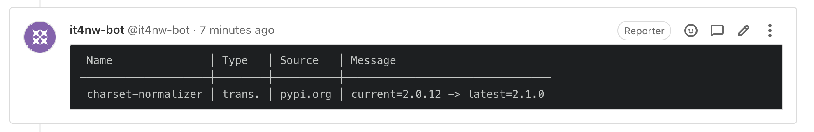

# Poetry dependencies scanner & gitlab commenter

This project consists of two scripts.

One analyses the `poetry.lock` and `pyproject.toml` files
it receives and produces an output listing the outdated
packages.

The other takes an input and posts it as a comment on a Gitlab
merge request.

Here's how we use them:

```yaml
# .gitlab-ci.yml

scan-deps:
  stage: test
  image: deps-scanner
  allow_failure: true
  script:
    - scan-deps poetry.lock pyproject.toml | comment-gitlab
  only:
    - merge_requests
```

The `deps-scanner` image is built from the Dockerfile in this repository.

Here's an example of what the output looks like in a merge request for
this repository:



## Installation

```bash
python -m pip install poetry-deps-scanner
```

## Dependencies analysis

The following snippet is an example output the first script may produce:

```
 Name        │ Type   │ Source        │ Message
─────────────┼────────┼───────────────┼───────────────────────────────────────
 command-log │ direct │ xxxxx.itsf.io │ current=1.0.0 -> latest=2.0.0
 coverage    │ direct │ pypi.org      │ current=6.3.2 -> latest=6.4.1
 asgiref     │ trans. │ pypi.org      │ current=3.5.1 -> latest=3.5.2
 grpclib     │ trans. │ github.com    │ Couldn't compare versions.
 requests    │ error  │               │ ValueError (Hello world)
```

The `Type` column indicates whether the package is a direct or transitive
dependency, or if there has been an uncaught exception:
* `direct` means the package is a direct dependency.
* `trans.` means the package is a transitive dependency: the dependency
  of a direct dependency or of a transitive dependency.
* `error` means there has been an uncaught error. The exception class and message
  are displayed in the `Message` column

This is computed by using the `pyproject.toml` if given. If this file is
not provided on the command line, the column will be empty.

A dependency is considered direct if it is present in the `pyproject.toml`.

## Gitlab comment

The `comment_gitlab.py` script requires some environment variables
to properly work:

* `BOT_USERNAME`: The username for the bot user
* `BOT_TOKEN`: A Gitlab access token for the bot user
  (see https://docs.gitlab.com/ee/user/profile/personal_access_tokens.html)
* `CI_SERVER_URL`: The URL of the Gitlab instance where to post
* `CI_PROJECT_ID`: The ID of the project containing the MR to post on
* `CI_MERGE_REQUEST_IID`: The IID of the merge request to comment on

The last three variables are automatically populated by Gitlab CI when
running a job as part of a detached pipeline (for a merge request). Notice
the `only: [merge_requests]` in the `.gitlab-ci.yml` above.

Of course, you can also provide them manually to integrate with any other build
system.

If a comment from the bot user already exists, it will be replaced,
in order to reduce the noise. In other words, there will be at most one
comment from the bot on a given merge request. It will contain the results of
the latest check.

## Build the docker image outside ITSF

The Dockerfile inside the repository references images from our internal
Docker registry proxy. You can easily build it on your own by removing
the `nexus.itsf.io:5005/` prefix.

```bash
# on Ubuntu
sed -i 's/nexus.itsf.io:5005\///g' Dockerfile
# on macOS
sed -e 's/nexus.itsf.io:5005\///g' -i "" Dockerfile
# then
docker build -t deps-scanner .
```
